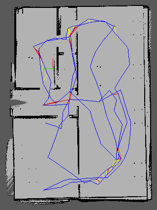

・ To build robot ball chaser, detail is [here.](https://github.com/mantues/udacity_robot_ball_chaser)


・ To build robot ball chaser AMCL package(ROS-kinetic-package), detail is [here.](https://github.com/mantues/udacity_robot_ball_chaser_kinetic_package)

---

# udacity_robot_rtabmap_slam_package
Udacity Robotics Software Engineer Nanodegree Program. This robot guesses where you are from the map using rtabmap_ros package [here.](http://wiki.ros.org/rtabmap_ros)

Easy way to build
```
$ bash build.sh
```
---
## Structure
```
udacity_robot_rtabmap_slam_package            # Project Files
├── myrobot
│   ├── launch
│   │   ├── nav_world.launch                  # launch my_robot in Gazebo
│   │   ├── rtab_localization.launch          # launch localization using rtab package
│   │   ├── rtab_mapping.launch               # launch rtab mapping package
│   │   ├── teleop.launch                     # launch teleop package
│   ├── rtab
│   │   └── trab_conf.ini                     # setting file rtab
│   ├── rviz
│   │   ├── rtabmap.rviz                      # Rviz setting file using rtabmap package
└── teleop_twist_keyboard                     # twist keyboard package
```
## rqt-graph


---
## Build package

Install [ROS kinetic (ros-kinetic-desktop-full)](http://wiki.ros.org/kinetic/Installation/Ubuntu) on Linux.
* Build requirement package(using shell script)
```
$ bash build.sh
```
* Build requirement package(using command script)

```
$ mkdir -p ~/Desktop/udacity_ws/src
$ cd ~/Desktop/udacity_ws/src
$ git clone https://github.com/mantues/udacity_robot_rtabmap_slam_package
$ git clone  -b kinetic-devel https://github.com/introlab/rtabmap_ros
$ chmod +x ~/Desktop/udacity_ws/src/udacity_robot_rtabmap_slam_package/teleop_twist_keyboard/*.py
$ cd ~/Desktop/udacity_ws
$ rosdep install --from-paths src --ignore-src --rosdistro kinetic -y
$ catkin_make
$ source ~/Desktop/udacity_ws/devel/setup.bash
```
---

## Make a world map using rtabmap package

Launch the myrobot node with below command.
```
$ roslaunch myrobot nav_world.launch
```
Launch the rtabmap package with below command in a new terminal window.
```
$ roslaunch myrobot rtab_mapping.launch
```
Control the robot to complete the map using teleop packagein a new terminal window.
```
$ roslaunch myrobot teleop.launch
```



## Launch rtabmap localization to estimate my position
```
$ cd ~/Desktop/udacity_ws/src/udacity_robot_rtabmap_slam_package/myrobot/rtab
$ wget "https://drive.google.com/uc?export=download&id=1EhMQ744hdfSfjw7-wT_2R4OdzvuctqmF" -O output.db
$ cd ~/Desktop/udacity_ws
$ roslaunch myrobot rtab_localization.launch
```
---


## [TIPS] Database Analysis

How to check point clowd data using rtabmap package.

Download data with below comamnd.
```
$ rtabmap-databaseViewer ~/Desktop/udacity_ws/src/udacity_robot_rtabmap_slam_package/myrobot/rtab/output.db
```

